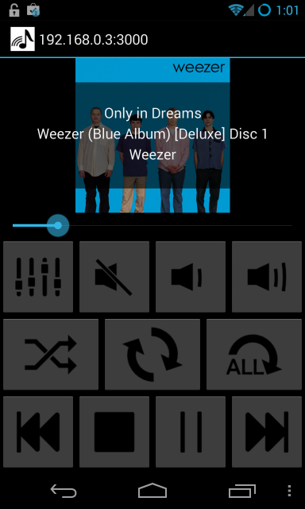

cmus-android-remote
===================


This is an Android application to remotely control your cmus music player.
This project was originally a fork of [seriousben's cmus-droid-remote](https://github.com/seriousben/cmus-droid-remote).

How to use this
===============

1) Start your cmus like so
```
cmus --listen 0.0.0.0
```
2) Set a cmus password (if you have not already)
```
:set passwd=<Your Password>
```
3) Install the apk on your android phone via [Play Store](https://play.google.com/store/apps/details?id=com.joshtwigg.cmus.droid), [this signed apk](app/app.apk) or cloning this repo and deploying it yourself. 

4) Add your ip address and password in settings and press 'okay'.

Features
========

* Save multiple cmus host configurations.
* Implemented functions include: mute/unmute, volume up/down, shuffle, repeat track/all/none, seek track, previous, forward, stop, play and pause.
* Current track information is displayed.
* Theme changes depending on Android OS version.
* Supports landscape and portrait mode.
* Automatically fetches album artwork from google (can be disabled).

More functionality to come.
